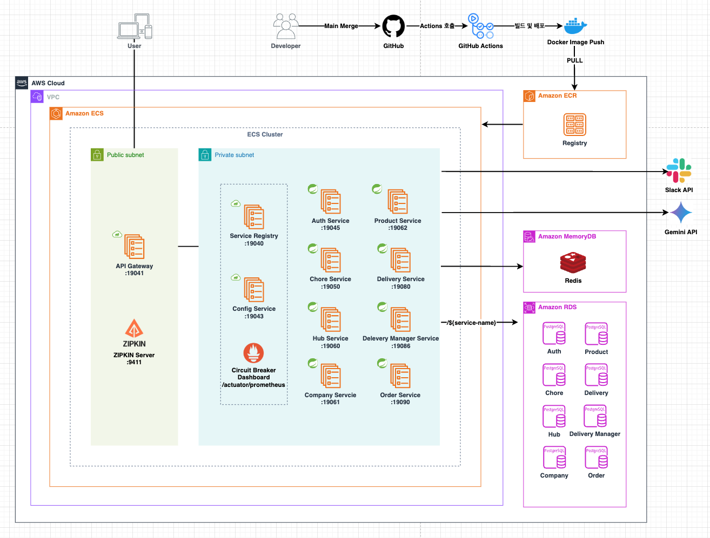
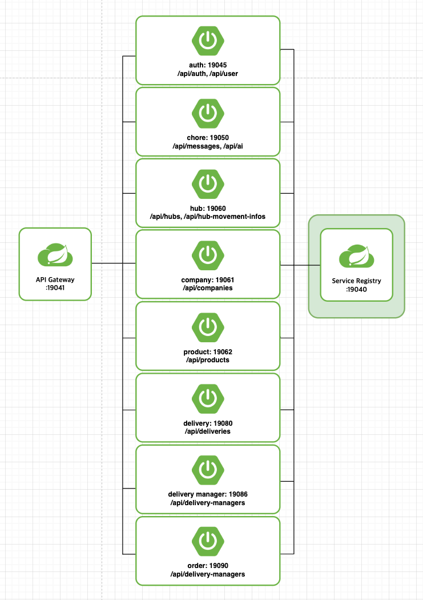
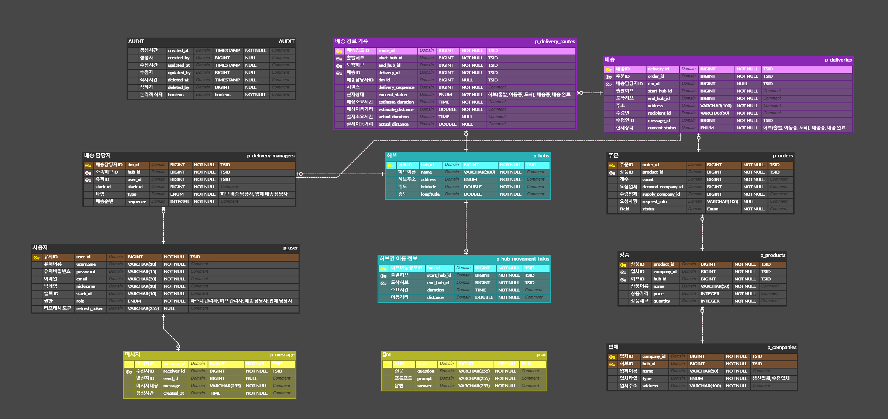

# FlowMesh: 물류 관리 및 배송 시스템
## 🤝 팀원 역할분담 

| 김영호                                            | 추지혜                                      | 양지수                                        |
|------------------------------------------------|------------------------------------------|--------------------------------------------|
| [@KIM-Yeongho](https://github.com/Kim-Yeongho) | [@JihyeChu](https://github.com/JihyeChu) | [@JISU-YANG](https://github.com/JISU-YANG) |
| 백엔드                                            | 백엔드                                      | 백엔드                                        |
| 주문, 배송, 배송경로                                   | 허브, 허브 이동경로, 업체, 상품                      | 사용자, 인증, AI, 메신저                           |

---

## 🎯 프로젝트 목표
- **Spring Cloud와 MSA 기본 개념 이해**  
  MSA의 원리를 학습하고 Spring Cloud를 활용하여 간단한 서비스 플랫폼을 구현할 수 있는 기초 역량 구축
- **RESTful API 설계 및 문서화**  
  표준화된 RESTful API를 설계하고, 이를 체계적으로 문서화하는 작업 수행
- **MSA의 장단점 분석 및 활용**  
  MSA의 장점(확장성, 독립 배포)과 단점(복잡성)을 직접 경험하고, 이를 통해 MSA가 적합한 상황과 활용 가능성을 모색

---

## 📐 서비스 구성
### 비전 인프라 아키텍처

### 현행 인프라 아키텍처

### 서비스 별 API 설계
[API 명세서](https://curious-chance-b88.notion.site/API-153133b141d68088a461f0550d1123eb?pvs=74)

---

## 🗄️ ERD

- [테이블 명세서](https://curious-chance-b88.notion.site/153133b141d68002bfbffd9bd41cbe53?pvs=74)
---

## 🛠️ 기술 스택
1. **프레임워크 및 런타임**
   - Spring Boot
      - Web: 웹 애플리케이션 개발
      - JPA: JPA 및 데이터베이스 연동
      - Validation: 데이터 검증
      - Actuator: 애플리케이션 모니터링 및 관리
   - Spring Cloud
       - Netflix Eureka (Client, Server): 서비스 레지스트리
       - Gateway: API 게이트웨이
       - OpenFeign: Feign 클라이언트 기반 통신
2. **보안 및 인증**
   - JWT (JSON Web Token)
       - JJWT: JWT 토큰 생성 및 처리
3. **데이터 관리**
   - 데이터베이스
       - PostgreSQL
   - Hibernate 유틸리티
       -  Hypersistence Utils: TSID 지원
4. **API 문서화**
   - Swagger
       - Springdoc OpenAPI: Swagger UI 및 OpenAPI 문서화
5. **개발 도구 및 코드 관리**
   - Lombok: 코드 자동 생성 및 로깅 도구 지원
   - GitHub: 버전관리
6. **API 확장**
   - HATEOAS: PagedModel 지원 및 리소스 탐색 링크 제공
   - Gemini API: AI 기반 예측 기능 확장
   - Slack API: 메신저 연동 및 알림 기능 확장

---

## 🚨 트러블 슈팅
- Swagger 500 Error
- PagedModel 생성자 주입 실패
- TSID 타입 도입 및 문자열 처리
- 브랜치 병합 충돌 및 복구
